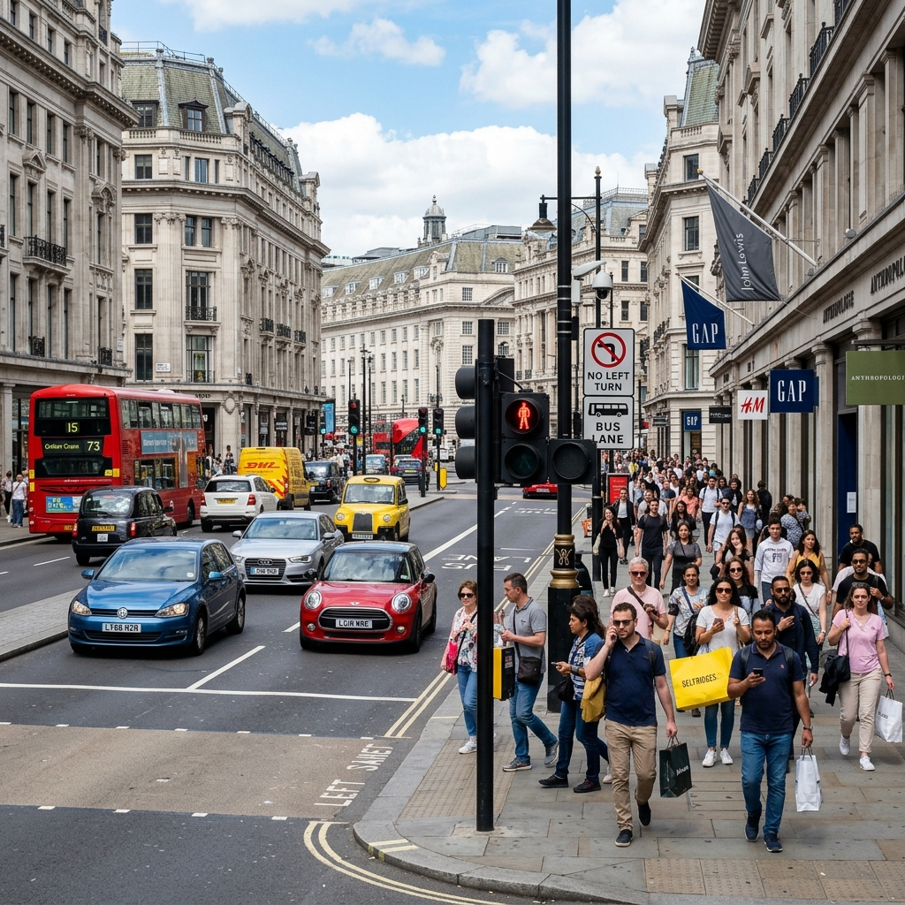
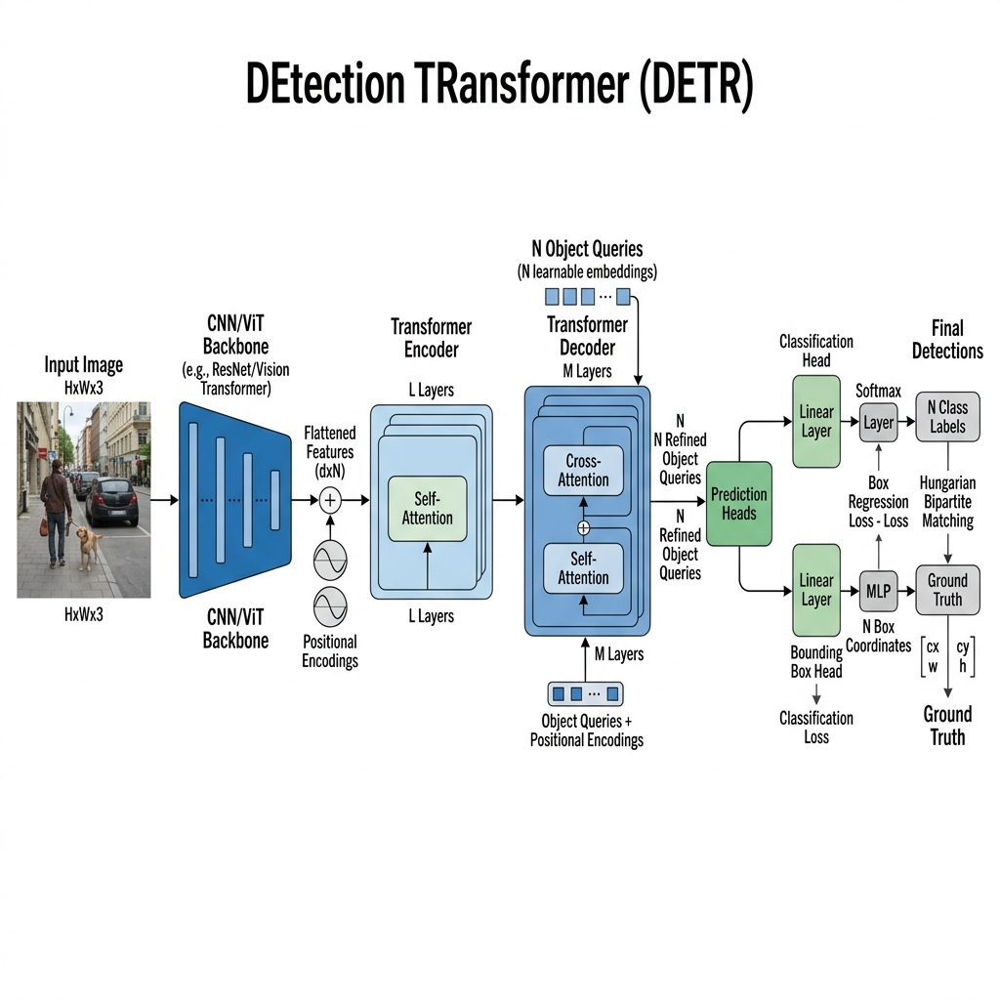

# DETR Benchmarking Studio: RF-DETR vs. RT-DETR vs. Original DETR

<div align="center">

[](https://retr-object-detection-studio-ryvtemx2nntyn58d7sigdh.streamlit.app/)

<h3>Click the badge above to run the live application</h3>

<p align="center">
  
  
</p>

*A professional, real-time computer vision suite comparing the evolution of Transformer-based Object Detectors.*

</div>
---

## 1. Project Overview & Rationale

Traditionally object detection has been dominated by **CNN-based architectures (like YOLO)**. While YOLO models are fast they rely heavily on hand-crafted post-processing heuristics like **Non-Maximum Suppression (NMS)** and anchor boxes to filter duplicate predictions which limits their generalization on out-of-distribution data.

In 2020 Facebook introduced **DETR (DEtection TRansformer)** framing object detection as a direct set-prediction problem. By using bipartite Hungarian matching DETR eliminated NMS and anchor boxes entirely. However original DETR was computationally heavy and slow to converge. 

This project is a **Benchmarking Studio** that implements and compares the three major evolutionary phases of DETR models:
1. **Original DETR (2020)**: The foundational academic baseline.
2. **RT-DETR (2023)**: Baidu's real-time highly optimized adaptation that competes directly with YOLO speed.
3. **RF-DETR (2026)**: Roboflow's state-of-the-art model that integrates neural architecture search (NAS) and self-supervised **DINOv2** vision transformer backbones to achieve superior zero-shot accuracy.

---

## 2. Model Architectures & Differences

Understanding the differences between these models explains why object detection has moved towards self-supervised transformer backbones and hybrid encoders.

| Feature / Model | 1. Original DETR (Facebook) | 2. RT-DETR (Baidu) | 3. RF-DETR (Roboflow) |
| :--- | :--- | :--- | :--- |
| **Backbone Network** | ResNet-50 / ResNet-101 (CNN) | ResNet / HGNet (CNN) | **DINOv2 (Vision Transformer)** |
| **Transformer Encoder** | Standard Transformer Encoder (O($N^2$) Self-Attention) | Hybrid Encoder (AIFI + CCFM) | Hybrid Encoder (Optimized via NAS) |
| **Query Selection** | Fixed Learnable Query Embeddings | Uncertainty-guided Query Selection | Uncertainty-guided Query Selection |
| **Inference Latency** | **High** (~200ms - 500ms) | **Ultra-Low** (~15ms - 25ms) | **Low** (~25ms - 45ms) |
| **Generalization Ability** | Moderate | Moderate (dataset-bound) | **Exceptional** (via DINOv2 self-supervision) |
| **Key Innovation** | Bipartite Hungarian matching | Eliminating encoder self-attention bottleneck | Weight-sharing Neural Architecture Search (NAS) |

---

## 3. End-to-End Pipeline Architecture & Rationale

Below is the step-by-step description of the execution pipeline, illustrating **what** happens at each step and **why** we do it.

```
 INPUT IMAGE 
      │                    (Step 1: Resize & normalize pixels)
      ▼
┌───────────┐
│ Backbone  │              (Step 2: Feature maps extraction via ResNet/DINOv2)
└─────┬─────┘
      │
  + Positional Encoding    (Step 3: Preserve 2D spatial coordinate relations)
      │
      ▼
┌───────────┐
│  Encoder  │              (Step 4: Self-attention scales context globally / AIFI + CCFM)
└─────┬─────┘
      │
  Select Top               (Step 5: Pick top-scoring query coordinates from encoder)
      │
      ▼
┌───────────┐
│  Decoder  │              (Step 6: Refine queries using self and cross-attention)
└─────┬─────┘
      │
┌─────┴─────┐
│   Heads   │              (Step 7: Classification + MLP Bounding Box Regressor)
└─────┬─────┘
      │
      ▼
 Hungarian                 (Step 8: One-to-one bipartite matching matching)
  Matching
      │
      ▼
  Losses                   (Step 9: Bipartite Loss optimization: Cross Entropy + L1 + GIoU)
```

---

### Step 1: Input Preprocessing (Resize & Normalize)
*   **What**: The input image is resized (typically to $640 \times 640$ pixels) and pixel values are normalized (subtracted by ImageNet mean and divided by standard deviation)
*   **Why**: Normalization prevents gradients from exploding or vanishing during backpropagation by ensuring input features have a stable and zero-centered distribution. Resizing ensures batch tensors are of uniform size.

### Step 2: Feature Map Extraction (Backbones)
*   **What**: The image is passed through a deep backbone network to extract hierarchical multi-scale feature maps
*   **Why**: 
    *   **Original DETR/RT-DETR** use CNN backbones to extract spatial patterns
    *   **RF-DETR** uses a **DINOv2 (ViT)** backbone. Because DINOv2 was trained using self-supervised learning on 142M curated images it captures rich semantic descriptors that are robust to lighting changes, weather and occlusions yielding massive improvements in zero-shot detection.

### Step 3: Positional Encoding Addition
*   **What**: Fixed sine/cosine or learnable 2D positional embeddings are added to the backbone feature maps
*   **Why**: Transformers use self-attention which is permutation-invariant (i.e. it treats the image as an unordered bag of pixels). Positional encodings restore the coordinates of the features so the network knows *where* each feature is located relative to others.

### Step 4: Contextual Feature Interaction (Transformer Encoder)
*   **What**: Features pass through self-attention layers to correlate pixels across the entire image.
    *   *Standard Encoder (Original DETR)*: Applies full self-attention across all spatial locations creating a massive computational bottleneck.
    *   *Hybrid Encoder (RT-DETR/RF-DETR)*: Combines **AIFI** (Attention-based Intra-scale Feature Interaction) which runs self-attention only on high-level feature maps and **CCFM** (Cross-scale Feature-fusion Module) which uses fast convolutions to merge multi-scale maps.
*   **Why**: This reduces the encoder computational complexity from $O(N^2)$ to a fraction allowing the model to run at real-time speeds (>30 FPS) while maintaining global context.

### Step 5: Query Selection & Decoder Routing
*   **What**: The model initializes $N$ object queries (typically 100 to 300)
    *   *Original DETR*: Uses random and statically learned query vectors
    *   *RT-DETR/RF-DETR*: Uses **Uncertainty-guided Query Selection** It evaluates the encoder outputthen identifies the top $N$ feature locations containing high-confidence objects and uses their spatial locations to initialize the decoder queries
*   **Why**: Starting decoder queries close to actual objects drastically accelerates training convergence (down from 500 epochs to 30 epochs) and increases spatial accuracy

### Step 6: Query Refinement (Transformer Decoder)
*   **What**: Queries pass through multiple decoder layers containing:
    1.  **Self-Attention**: Queries interact with each other (e.g. "Don't predict a car on top of another car")
    2.  **Cross-Attention**: Queries query the encoded image features (e.g. "Look for wheels or windows in this region")
*   **Why**: This updates query embeddings to contain localized feature information and iteratively refining the object boundaries

### Step 7: Prediction Heads (FFN)
*   **What**: Refined queries are split into two parallel feed-forward network (FFN) heads:
    *   **Linear Classifier**: Outputs class probabilities.
    *   **MLP Regressor**: Predicts normalized coordinates: center coordinates, width and height $(c_x, c_y, w, h)$
*   **Why**: Decoupling classification and coordinate regression allows each head to specialize in its respective math space (cross-entropy vs. spatial coordinates)

### Step 8: Bipartite Hungarian Matching
*   **What**: Compares the $N$ predictions against the $M$ ground-truth objects using bipartite  Hungarian matching to find the optimal one-to-one assignment
*   **Why**: Standard detectors (like YOLO) match one ground-truth object to multiple prediction anchors and then filter duplicates using NMS. Bipartite matching guarantees that **each physical object matches exactly one prediction head** completely eliminating duplicate boxes and the need for slow NMS during inference

### Step 9: Combined Loss Optimization
*   **What**: The training loss is computed as a weighted sum of three distinct losses:
    1.  **Classification Loss**: Cross-Entropy (or Focal Loss) to measure category correctness.
    2.  **L1 Bounding Box Loss**: Measures absolute coordinate distances: $\|b_i - \hat{b}\|_1$.
    3.  **GIoU (Generalized IoU) Loss**: Measures box shape, overlap and alignment.
*   **Why**: L1 loss scales with the size of the box (larger boxes have higher loss). GIoU loss is scale-invariant and provides gradients even if the predicted box and the ground-truth box do not overlap at all ensuring stable training.

---

## 4. Real-World Use Cases: Which Model to Choose?

1.  **Choose RF-DETR (Roboflow)** when:
    *   You are deploying to a domain with unique visual characteristics (e.g. satellite imagery, underwater robotics, micro-defect inspection or medical scanning)
    *   You have a very small labeled dataset and need high zero-shot transfer learning capability
    *   *Optimal hardware*: NVIDIA T4/A10G or higher

2.  **Choose RT-DETR (Baidu / Ultralytics)** when:
    *   You need real-time edge performance (processing live RTSP video feeds or webcams at 30+ FPS)
    *   You are training on standard datasets (like COCO) and deploying to environments with standard everyday objects (e.g. security cameras, self-driving cars)
    *   *Optimal hardware*: GPU/CPU edge devices

3.  **Choose Original DETR (Facebook)** when:
    *   You are conducting academic research or comparing transformer attention maps
    *   Latency is not a constraint (e.g. batch offline processing of archives)

---

## 5. Local Setup & Execution Guide

Follow these steps to run the Streamlit benchmarking studio locally on your machine.

### 1. Set Up Environment
Navigate to the project folder, initialize a virtual environment and activate it:
```bash
# Navigate to workspace
cd "c:\Users\WellCome\Desktop\Object Detection Project"

# Create virtual environment
python -m venv venv

# Activate on Windows (PowerShell)
.\venv\Scripts\Activate.ps1

# Activate on macOS/Linux
source venv/bin/activate
```

### 2. Install Package Dependencies
Install the required libraries:
```bash
pip install -r requirements.txt
```

### 3. Verify Integrations (Automated Test)
Run the pre-configured test script to verify model loading and mock inference:
```bash
python test_models.py
```

### 4. Run the Streamlit Dashboard
Launch the web application locally:
```bash
streamlit run app.py
```
This will open the application in your default web browser at `http://localhost:8501`.

---

## 6. Lightning.ai & Cloud Deployment

This application is fully compatible with cloud containers like **Lightning.ai** or **Streamlit Community Cloud**:
*   `packages.txt` is pre-configured with system-level dependencies (`libgl1-mesa-glx` and `libglib2.0-0`) to ensure headless OpenCV builds successfully.
*   `requirements.txt` utilizes `opencv-python-headless` to eliminate GUI dependencies.

### How to run project on Lightning.ai:
1.  Create a **New Studio** (CPU or GPU) on [lightning.ai](https://lightning.ai/).
2.  Upload your project files (excluding `venv/`).
3.  In the Studio terminal, run: `pip install -r requirements.txt`
4.  Launch the app: `streamlit run app.py --server.port 8501 --server.address 0.0.0.0`
5.  Open port `8501` in the **Ports** panel to view the live dashboard


<p align="center">
  
</p>

---

<p align="center">
  
</p>

---

<p align="center">
  
</p>

---

<p align="center">
  
</p>

---


<p align="center">
  
</p>

---

<p align="center">
  
</p>

